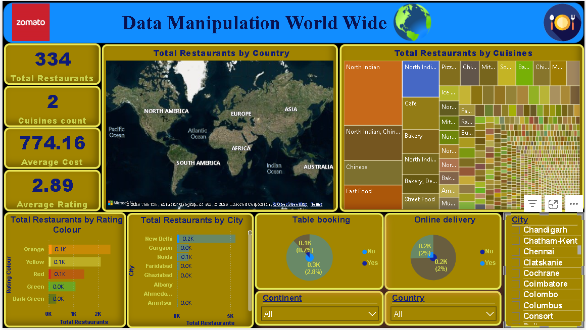

# 📊 Zomato Restaurant Analytics Dashboard (Power BI)

## 📌 Overview
This project analyzes global restaurant data from Zomato to uncover insights into restaurant distribution, customer ratings, costs, and cuisines. The dashboard enables interactive exploration of data across multiple geographical and business dimensions.

---

## 🎯 Objective
To build an interactive Power BI dashboard that helps stakeholders analyze restaurant performance, customer preferences, and global distribution trends.

---

## 🧰 Tools & Technologies
- Microsoft Power BI
- Power Query (Data Transformation)
- DAX (Data Analysis Expressions)
- Excel (Data Source)

---

## 📁 Dataset
The dataset consists of multiple Excel files containing restaurant data across different countries and continents.

---

## 🧹 Data Cleaning & Transformation
- Corrected inconsistent city names (e.g., São Paulo, Istanbul)
- Removed unnecessary columns
- Created separate columns for restaurant name and address
- Built a cuisine dimension table
- Ensured unique country codes for proper relationships

---

## 📊 Key Metrics (DAX Measures)
- Total Restaurants
- Average Cost
- Average Rating
- Cuisine Count

---

## 📈 Dashboard Features

### 🌍 Global Overview
- Total restaurants worldwide
- Country and city distribution
- Drill-down capability

### ⭐ Ratings Analysis
- Average ratings by restaurant
- Rating distribution with color coding

### 💰 Cost Analysis
- Restaurants with lowest and highest average cost

### 🍽️ Cuisine Insights
- Most popular cuisines
- Cuisine distribution across regions

### 🔍 Filters
- Country, City
- Online delivery / Table booking
- Rating categories

---

## 📊 Outcome
The dashboard enables data-driven decision-making by providing a comprehensive view of restaurant performance and customer preferences across regions.

---

## 🚀 Skills Demonstrated
- Data Cleaning and Transformation (Power Query)
- Data Modeling
- DAX Calculations
- Interactive Dashboard Design
- Business Data Analysis

## 📊 Dashboard Preview

